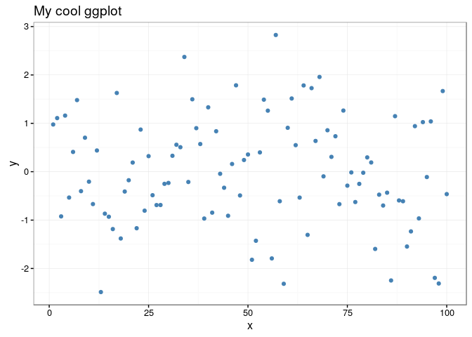
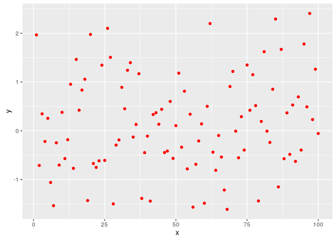

[](http://www.repostatus.org/#wip) [](https://travis-ci.org/jonocarroll/ggghost) [](https://ci.appveyor.com/project/jonocarroll/ggghost) [](https://codecov.io/gh/jonocarroll/ggghost) [](https://github.com/jonocarroll/ggghost/network) [](https://github.com/jonocarroll/ggghost/stargazers) [](https://twitter.com/intent/tweet?text=Wow:&url=%5Bobject%20Object%5D) [](https://cran.r-project.org/package=ggghost) [](commits/master) [](/commits/master)

<!-- README.md is generated from README.Rmd. Please edit that file -->
Oh, no! I think I saw a ... *g-g-ghost*
=======================================

Capture the spirit of your `ggplot` calls.


Motivation
----------

`ggplot` stores the information needed to build the graph as a `grob`, but that's what the **computer** needs to know about in order to build the graph. As humans, we're more interested in what commands were issued in order to build the graph. Here is one option that solves that problem.

`ggghost` stores the `ggplot` commands (usually separated by `+`) as they are generated, in effect lazily collecting the calls. Once the object is requested, the `print` method combines the individual calls back into the total plotting command and executes it. This is where the call would usually be discarded. Instead, a "ghost" of the commands lingers in the object for further investigation, subsetting, or adding to.

Installation
------------

You can install `ggghost` from github with:

``` r
# install.packages("devtools")
devtools::install_github("jonocarroll/ggghost")
```

Usage
-----

use `%g<%` to initiate storage of the `ggplot` calls then add to the call with each logical call on a new line (@hrbrmstr style)

``` r
tmp <- data.frame(x = 1:100, y = rnorm(100))

library(ggplot2)
library(ggghost)
z %g<% ggplot(tmp, aes(x,y))
z <- z + geom_point(col = "steelblue")
z <- z + theme_bw()
z <- z + labs(title = "My cool ggplot")
z <- z + labs(x = "x axis", y = "y axis")
z <- z + geom_smooth()
```

This invisibly stores the `ggplot` calls in a list which can be reviewed either with the list of calls

``` r
summary(z)
#> [[1]]
#> ggplot(tmp, aes(x, y))
#> 
#> [[2]]
#> geom_point(col = "steelblue")
#> 
#> [[3]]
#> theme_bw()
#> 
#> [[4]]
#> labs(title = "My cool ggplot")
#> 
#> [[5]]
#> labs(x = "x axis", y = "y axis")
#> 
#> [[6]]
#> geom_smooth()
```

or the concatenated call

``` r
summary(z, combine = TRUE)
#> [1] "ggplot(tmp, aes(x, y)) + geom_point(col = \"steelblue\") + theme_bw() + labs(title = \"My cool ggplot\") + labs(x = \"x axis\", y = \"y axis\") + geom_smooth()"
```

The plot can be generated using a `print` method

``` r
z
```



The call list can be subset, removing parts of the call

``` r
(z2 <- subset(z, c(1,2,6)))
```


Plot features can be removed by name, a task that would otherwise have involved re-generating the entire plot

``` r
z3 <- z + geom_line(col = "coral")
z3 <- z3 - geom_point()
z3
```


Calls are removed based on matching to the regex `\\(.*$` (from the first bracket to the end of the call), so arguments are irrelevant.

The object still contains all the grob info, it's just stored as calls rather than a completed image.

``` r
str(print(z))
#> List of 3
#>  $ data :List of 2
#>   ..$ :'data.frame': 100 obs. of  10 variables:
#>   .. ..$ x     : num [1:100] 1 2 3 4 5 6 7 8 9 10 ...
#>   .. ..$ y     : num [1:100] 1.967 -0.711 0.348 -0.219 0.256 ...
#>   .. ..$ PANEL : int [1:100] 1 1 1 1 1 1 1 1 1 1 ...
#>   .. ..$ group : int [1:100] -1 -1 -1 -1 -1 -1 -1 -1 -1 -1 ...
#>   .. ..$ shape : num [1:100] 19 19 19 19 19 19 19 19 19 19 ...
#>   .. ..$ colour: chr [1:100] "steelblue" "steelblue" "steelblue" "steelblue" ...
#>   .. ..$ size  : num [1:100] 1.5 1.5 1.5 1.5 1.5 1.5 1.5 1.5 1.5 1.5 ...
#>   .. ..$ fill  : logi [1:100] NA NA NA NA NA NA ...
#>   .. ..$ alpha : logi [1:100] NA NA NA NA NA NA ...
#>   .. ..$ stroke: num [1:100] 0.5 0.5 0.5 0.5 0.5 0.5 0.5 0.5 0.5 0.5 ...
#>   ..$ :'data.frame': 80 obs. of  13 variables:
#>   .. ..$ x       : num [1:80] 1 2.25 3.51 4.76 6.01 ...
#>   .. ..$ y       : num [1:80] -0.12259 -0.09112 -0.06116 -0.0327 -0.00576 ...
#>   .. ..$ ymin    : num [1:80] -0.845 -0.755 -0.671 -0.593 -0.521 ...
#>   .. ..$ ymax    : num [1:80] 0.6 0.573 0.549 0.527 0.509 ...
#>   .. ..$ se      : num [1:80] 0.364 0.335 0.307 0.282 0.259 ...
#>   .. ..$ PANEL   : int [1:80] 1 1 1 1 1 1 1 1 1 1 ...
#>   .. ..$ group   : int [1:80] -1 -1 -1 -1 -1 -1 -1 -1 -1 -1 ...
#>   .. ..$ colour  : chr [1:80] "#3366FF" "#3366FF" "#3366FF" "#3366FF" ...
#>   .. ..$ fill    : chr [1:80] "grey60" "grey60" "grey60" "grey60" ...
#>   .. ..$ size    : num [1:80] 1 1 1 1 1 1 1 1 1 1 ...
#>   .. ..$ linetype: num [1:80] 1 1 1 1 1 1 1 1 1 1 ...
#>   .. ..$ weight  : num [1:80] 1 1 1 1 1 1 1 1 1 1 ...
#>   .. ..$ alpha   : num [1:80] 0.4 0.4 0.4 0.4 0.4 0.4 0.4 0.4 0.4 0.4 ...
#> [... truncated ...]
```

`ggplot` still works as normal if you want to avoid storing the calls.

``` r
ggplot(tmp) + geom_point(aes(x,y), col = "red")
```



Show the process of building up the plot as a (re-)animation

``` r
lazarus(z, "mycoolplot.gif")
```

