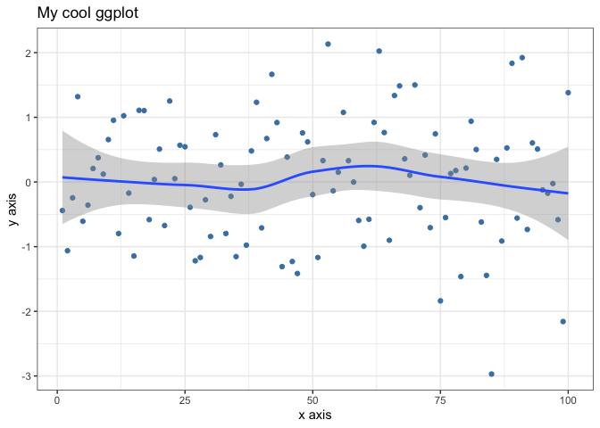
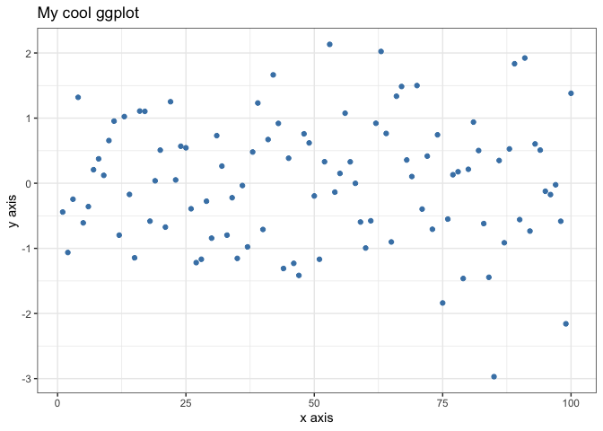
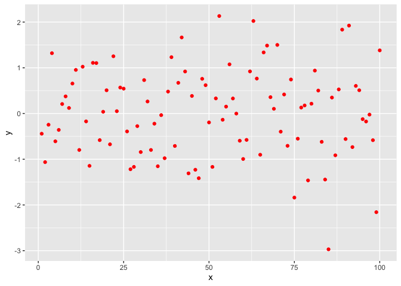

<!-- badges: start -->

[](https://github.com/jonocarroll/ggghost/actions/workflows/R-CMD-check.yaml)
<!-- badges: end -->

<!-- README.md is generated from README.Rmd. Please edit that file -->

# :ghost: *Oh, no! I think I saw a … g-g-ghost*


Capture the spirit of your `ggplot2` calls.

## Motivation

`ggplot2::ggplot()` stores the information needed to build the graph as
a `grob`, but that’s what the **computer** needs to know about in order
to build the graph. As humans, we’re more interested in what commands
were issued in order to build the graph. For good reproducibility, the
calls need to be applied to the relevant data. While this is somewhat
available by deconstructing the `grob`, it’s not the simplest approach.

Here is one option that solves that problem.

`ggghost` stores the data used in a `ggplot()` call, and collects
`ggplot2` commands (usually separated by `+`) as they are applied, in
effect lazily collecting the calls. Once the object is requested, the
`print` method combines the individual calls back into the total
plotting command and executes it. This is where the call would usually
be discarded. Instead, a “ghost” of the commands lingers in the object
for further investigation, subsetting, adding to, or subtracting from.

## Installation

You can install `ggghost` from CRAN with:

``` r
install.packages("ggghost")
```

or the development version from github with:

``` r
# install.packages("devtools")
devtools::install_github("jonocarroll/ggghost")
```

## Usage

use `%g<%` to initiate storage of the `ggplot2` calls then add to the
call with each logical call on a new line (@hrbrmstr style)

``` r
tmpdata <- data.frame(x = 1:100, y = rnorm(100))
head(tmpdata)
#>   x          y
#> 1 1 -0.4418719
#> 2 2 -1.0635266
#> 3 3 -0.2451387
#> 4 4  1.3193699
#> 5 5 -0.6082226
#> 6 6 -0.3583586
```

``` r
library(ggplot2)
library(ggghost)
z %g<% ggplot(tmpdata, aes(x, y))
z <- z + geom_point(col = "steelblue")
z <- z + theme_bw()
z <- z + labs(title = "My cool ggplot")
z <- z + labs(x = "x axis", y = "y axis")
z <- z + geom_smooth()
```

This invisibly stores the `ggplot2` calls in a list which can be
reviewed either with the list of calls

``` r
summary(z)
#> [[1]]
#> ggplot(tmpdata, aes(x, y))
#> 
#> [[2]]
#> geom_point(col = "steelblue")
#> 
#> [[3]]
#> theme_bw()
#> 
#> [[4]]
#> labs(title = "My cool ggplot")
#> 
#> [[5]]
#> labs(x = "x axis", y = "y axis")
#> 
#> [[6]]
#> geom_smooth()
```

or the concatenated call

``` r
summary(z, combine = TRUE)
#> [1] "ggplot(tmpdata, aes(x, y)) + geom_point(col = \"steelblue\") + theme_bw() + labs(title = \"My cool ggplot\") + labs(x = \"x axis\", y = \"y axis\") + geom_smooth()"
```

The plot can be generated using a `print` method

``` r
z
```

<!-- -->

which re-evaluates the list of calls and applies them to the saved data,
meaning that the plot remains reproducible even if the data source is
changed/destroyed.

The call list can be subset, removing parts of the call

``` r
subset(z, c(1,2,6))
```

<!-- -->

Plot features can be removed by name, a task that would otherwise have
involved re-generating the entire plot

``` r
z2 <- z + geom_line(col = "coral")
z2 - geom_point()
```

<!-- -->

Calls are removed based on matching to the regex `\\(.*$` (from the
first bracket to the end of the call), so arguments are irrelevant. The
possible matches can be found with `summary(z)` as above

The object still generates all the `grob` info, it’s just stored as
calls rather than a completed image.

``` r
str(print(z))
#> <ggplot2::ggplot>
#>  @ data       :'data.frame': 100 obs. of  2 variables:
#>  .. $ x: int  1 2 3 4 5 6 7 8 9 10 ...
#>  .. $ y: num  -0.442 -1.064 -0.245 1.319 -0.608 ...
#>  @ layers     :List of 2
#>  .. $ geom_point :Classes 'LayerInstance', 'Layer', 'ggproto', 'gg' <ggproto object: Class LayerInstance, Layer, gg>
#>     aes_params: list
#>     compute_aesthetics: function
#>     compute_geom_1: function
#>     compute_geom_2: function
#>     compute_position: function
#>     compute_statistic: function
#>     computed_geom_params: list
#>     computed_mapping: ggplot2::mapping, uneval, gg, S7_object
#>     computed_stat_params: list
#>     constructor: call
#>     data: waiver
#>     draw_geom: function
#>     finish_statistics: function
#>     geom: <ggproto object: Class GeomPoint, Geom, gg>
#>         aesthetics: function
#>         default_aes: ggplot2::mapping, uneval, gg, S7_object
#>         draw_group: function
#>         draw_key: function
#>         draw_layer: function
#>         draw_panel: function
#>         extra_params: na.rm
#>         handle_na: function
#>         non_missing_aes: size shape colour
#>         optional_aes: 
#>         parameters: function
#>         rename_size: FALSE
#>         required_aes: x y
#>         setup_data: function
#>         setup_params: function
#>         use_defaults: function
#>         super:  <ggproto object: Class Geom, gg>
#>     geom_params: list
#>     inherit.aes: TRUE
#>     layer_data: function
#>     layout: NULL
#>     map_statistic: function
#>     mapping: NULL
#>     name: NULL
#>     position: <ggproto object: Class PositionIdentity, Position, gg>
#>         aesthetics: function
#>         compute_layer: function
#>         compute_panel: function
#>         default_aes: ggplot2::mapping, uneval, gg, S7_object
#>         required_aes: 
#>         setup_data: function
#>         setup_params: function
#>         use_defaults: function
#>         super:  <ggproto object: Class Position, gg>
#>     print: function
#>     setup_layer: function
#>     show.legend: NA
#>     stat: <ggproto object: Class StatIdentity, Stat, gg>
#>         aesthetics: function
#>         compute_group: function
#>         compute_layer: function
#>         compute_panel: function
#>         default_aes: ggplot2::mapping, uneval, gg, S7_object
#>         dropped_aes: 
#>         extra_params: na.rm
#>         finish_layer: function
#>         non_missing_aes: 
#>         optional_aes: 
#>         parameters: function
#>         required_aes: 
#>         retransform: TRUE
#>         setup_data: function
#>         setup_params: function
#>         super:  <ggproto object: Class Stat, gg>
#>     stat_params: list
#>     super:  <ggproto object: Class Layer, gg> 
#>  .. $ geom_smooth:Classes 'LayerInstance', 'Layer', 'ggproto', 'gg' <ggproto object: Class LayerInstance, Layer, gg>
#>     aes_params: list
#>     compute_aesthetics: function
#>     compute_geom_1: function
#>     compute_geom_2: function
#>     compute_position: function
#>     compute_statistic: function
#>     computed_geom_params: list
#>     computed_mapping: ggplot2::mapping, uneval, gg, S7_object
#>     computed_stat_params: list
#>     constructor: call
#>     data: waiver
#>     draw_geom: function
#>     finish_statistics: function
#>     geom: <ggproto object: Class GeomSmooth, Geom, gg>
#>         aesthetics: function
#>         default_aes: ggplot2::mapping, uneval, gg, S7_object
#>         draw_group: function
#>         draw_key: function
#>         draw_layer: function
#>         draw_panel: function
#>         extra_params: na.rm orientation
#>         handle_na: function
#>         non_missing_aes: 
#>         optional_aes: ymin ymax
#>         parameters: function
#>         rename_size: TRUE
#>         required_aes: x y
#>         setup_data: function
#>         setup_params: function
#>         use_defaults: function
#>         super:  <ggproto object: Class Geom, gg>
#>     geom_params: list
#>     inherit.aes: TRUE
#>     layer_data: function
#>     layout: NULL
#>     map_statistic: function
#>     mapping: NULL
#>     name: NULL
#>     position: <ggproto object: Class PositionIdentity, Position, gg>
#>         aesthetics: function
#>         compute_layer: function
#>         compute_panel: function
#>         default_aes: ggplot2::mapping, uneval, gg, S7_object
#>         required_aes: 
#>         setup_data: function
#>         setup_params: function
#>         use_defaults: function
#>         super:  <ggproto object: Class Position, gg>
#>     print: function
#>     setup_layer: function
#>     show.legend: NA
#>     stat: <ggproto object: Class StatSmooth, Stat, gg>
#>         aesthetics: function
#>         compute_group: function
#>         compute_layer: function
#>         compute_panel: function
#>         default_aes: ggplot2::mapping, uneval, gg, S7_object
#>         dropped_aes: weight
#>         extra_params: na.rm orientation
#>         finish_layer: function
#>         non_missing_aes: 
#>         optional_aes: 
#>         parameters: function
#>         required_aes: x y
#>         retransform: TRUE
#>         setup_data: function
#>         setup_params: function
#>         super:  <ggproto object: Class Stat, gg>
#>     stat_params: list
#>     super:  <ggproto object: Class Layer, gg> 
#>  @ scales     :Classes 'ScalesList', 'ggproto', 'gg' <ggproto object: Class ScalesList, gg>
#>     add: function
#>     add_defaults: function
#>     add_missing: function
#>     backtransform_df: function
#>     clone: function
#>     find: function
#>     get_scales: function
#>     has_scale: function
#>     input: function
#>     map_df: function
#>     n: function
#>     non_position_scales: function
#>     scales: list
#>     set_palettes: function
#>     train_df: function
#>     transform_df: function
#>     super:  <ggproto object: Class ScalesList, gg> 
#>  @ guides     :Classes 'Guides', 'ggproto', 'gg' <ggproto object: Class Guides, gg>
#>     add: function
#>     assemble: function
#>     build: function
#>     draw: function
#>     get_custom: function
#>     get_guide: function
#>     get_params: function
#>     get_position: function
#>     guides: NULL
#>     merge: function
#>     missing: <ggproto object: Class GuideNone, Guide, gg>
#>         add_title: function
#>         arrange_layout: function
#>         assemble_drawing: function
#>         available_aes: any
#>         build_decor: function
#>         build_labels: function
#>         build_ticks: function
#>         build_title: function
#>         draw: function
#>         draw_early_exit: function
#>         elements: list
#>         extract_decor: function
#>         extract_key: function
#>         extract_params: function
#>         get_layer_key: function
#>         hashables: list
#>         measure_grobs: function
#>         merge: function
#>         override_elements: function
#>         params: list
#>         process_layers: function
#>         setup_elements: function
#>         setup_params: function
#>         train: function
#>         transform: function
#>         super:  <ggproto object: Class GuideNone, Guide, gg>
#>     package_box: function
#>     print: function
#>     process_layers: function
#>     setup: function
#>     subset_guides: function
#>     train: function
#>     update_params: function
#>     super:  <ggproto object: Class Guides, gg> 
#>  @ mapping    : <ggplot2::mapping> List of 2
#>  .. $ x: language ~x
#>  ..  ..- attr(*, ".Environment")=<environment: 0x14b660d00> 
#>  .. $ y: language ~y
#>  ..  ..- attr(*, ".Environment")=<environment: 0x14b660d00> 
#>  @ theme      : <theme> List of 144
#>  .. $ line                            : <ggplot2::element_line>
#>  ..  ..@ colour       : chr "black"
#>  ..  ..@ linewidth    : num 0.5
#>  ..  ..@ linetype     : num 1
#>  ..  ..@ lineend      : chr "butt"
#>  ..  ..@ linejoin     : chr "round"
#>  ..  ..@ arrow        : logi FALSE
#>  ..  ..@ arrow.fill   : chr "black"
#>  ..  ..@ inherit.blank: logi TRUE
#>  .. $ rect                            : <ggplot2::element_rect>
#>  ..  ..@ fill         : chr "white"
#>  ..  ..@ colour       : chr "black"
#>  ..  ..@ linewidth    : num 0.5
#>  ..  ..@ linetype     : num 1
#>  ..  ..@ linejoin     : chr "round"
#>  ..  ..@ inherit.blank: logi TRUE
#>  .. $ text                            : <ggplot2::element_text>
#>  ..  ..@ family       : chr ""
#>  ..  ..@ face         : chr "plain"
#>  ..  ..@ italic       : chr NA
#>  ..  ..@ fontweight   : num NA
#>  ..  ..@ fontwidth    : num NA
#>  ..  ..@ colour       : chr "black"
#>  ..  ..@ size         : num 11
#>  ..  ..@ hjust        : num 0.5
#>  ..  ..@ vjust        : num 0.5
#>  ..  ..@ angle        : num 0
#>  ..  ..@ lineheight   : num 0.9
#>  ..  ..@ margin       : <ggplot2::margin> num [1:4] 0 0 0 0
#>  ..  ..@ debug        : logi FALSE
#>  ..  ..@ inherit.blank: logi TRUE
#>  .. $ title                           : <ggplot2::element_text>
#>  ..  ..@ family       : NULL
#>  ..  ..@ face         : NULL
#>  ..  ..@ italic       : chr NA
#>  ..  ..@ fontweight   : num NA
#>  ..  ..@ fontwidth    : num NA
#>  ..  ..@ colour       : NULL
#>  ..  ..@ size         : NULL
#>  ..  ..@ hjust        : NULL
#>  ..  ..@ vjust        : NULL
#>  ..  ..@ angle        : NULL
#>  ..  ..@ lineheight   : NULL
#>  ..  ..@ margin       : NULL
#>  ..  ..@ debug        : NULL
#>  ..  ..@ inherit.blank: logi TRUE
#>  .. $ point                           : <ggplot2::element_point>
#>  ..  ..@ colour       : chr "black"
#>  ..  ..@ shape        : num 19
#>  ..  ..@ size         : num 1.5
#>  ..  ..@ fill         : chr "white"
#>  ..  ..@ stroke       : num 0.5
#>  ..  ..@ inherit.blank: logi TRUE
#>  .. $ polygon                         : <ggplot2::element_polygon>
#>  ..  ..@ fill         : chr "white"
#>  ..  ..@ colour       : chr "black"
#>  ..  ..@ linewidth    : num 0.5
#>  ..  ..@ linetype     : num 1
#>  ..  ..@ linejoin     : chr "round"
#>  ..  ..@ inherit.blank: logi TRUE
#>  .. $ geom                            : <ggplot2::element_geom>
#>  ..  ..@ ink        : chr "black"
#>  ..  ..@ paper      : chr "white"
#>  ..  ..@ accent     : chr "#3366FF"
#>  ..  ..@ linewidth  : num 0.5
#>  ..  ..@ borderwidth: num 0.5
#>  ..  ..@ linetype   : int 1
#>  ..  ..@ bordertype : int 1
#>  ..  ..@ family     : chr ""
#>  ..  ..@ fontsize   : num 3.87
#>  ..  ..@ pointsize  : num 1.5
#>  ..  ..@ pointshape : num 19
#>  ..  ..@ colour     : NULL
#>  ..  ..@ fill       : NULL
#>  .. $ spacing                         : 'simpleUnit' num 5.5points
#>  ..  ..- attr(*, "unit")= int 8
#>  .. $ margins                         : <ggplot2::margin> num [1:4] 5.5 5.5 5.5 5.5
#>  .. $ aspect.ratio                    : NULL
#>  .. $ axis.title                      : NULL
#>  .. $ axis.title.x                    : <ggplot2::element_text>
#>  ..  ..@ family       : NULL
#>  ..  ..@ face         : NULL
#>  ..  ..@ italic       : chr NA
#>  ..  ..@ fontweight   : num NA
#>  ..  ..@ fontwidth    : num NA
#>  ..  ..@ colour       : NULL
#>  ..  ..@ size         : NULL
#>  ..  ..@ hjust        : NULL
#>  ..  ..@ vjust        : num 1
#>  ..  ..@ angle        : NULL
#>  ..  ..@ lineheight   : NULL
#>  ..  ..@ margin       : <ggplot2::margin> num [1:4] 2.75 0 0 0
#>  ..  ..@ debug        : NULL
#>  ..  ..@ inherit.blank: logi TRUE
#>  .. $ axis.title.x.top                : <ggplot2::element_text>
#>  ..  ..@ family       : NULL
#>  ..  ..@ face         : NULL
#>  ..  ..@ italic       : chr NA
#>  ..  ..@ fontweight   : num NA
#>  ..  ..@ fontwidth    : num NA
#>  ..  ..@ colour       : NULL
#>  ..  ..@ size         : NULL
#>  ..  ..@ hjust        : NULL
#>  ..  ..@ vjust        : num 0
#>  ..  ..@ angle        : NULL
#>  ..  ..@ lineheight   : NULL
#>  ..  ..@ margin       : <ggplot2::margin> num [1:4] 0 0 2.75 0
#>  ..  ..@ debug        : NULL
#>  ..  ..@ inherit.blank: logi TRUE
#>  .. $ axis.title.x.bottom             : NULL
#>  .. $ axis.title.y                    : <ggplot2::element_text>
#>  ..  ..@ family       : NULL
#>  ..  ..@ face         : NULL
#>  ..  ..@ italic       : chr NA
#>  ..  ..@ fontweight   : num NA
#>  ..  ..@ fontwidth    : num NA
#>  ..  ..@ colour       : NULL
#>  ..  ..@ size         : NULL
#>  ..  ..@ hjust        : NULL
#>  ..  ..@ vjust        : num 1
#>  ..  ..@ angle        : num 90
#>  ..  ..@ lineheight   : NULL
#>  ..  ..@ margin       : <ggplot2::margin> num [1:4] 0 2.75 0 0
#>  ..  ..@ debug        : NULL
#>  ..  ..@ inherit.blank: logi TRUE
#>  .. $ axis.title.y.left               : NULL
#>  .. $ axis.title.y.right              : <ggplot2::element_text>
#>  ..  ..@ family       : NULL
#>  ..  ..@ face         : NULL
#>  ..  ..@ italic       : chr NA
#>  ..  ..@ fontweight   : num NA
#>  ..  ..@ fontwidth    : num NA
#>  ..  ..@ colour       : NULL
#>  ..  ..@ size         : NULL
#>  ..  ..@ hjust        : NULL
#>  ..  ..@ vjust        : num 1
#>  ..  ..@ angle        : num -90
#>  ..  ..@ lineheight   : NULL
#>  ..  ..@ margin       : <ggplot2::margin> num [1:4] 0 0 0 2.75
#>  ..  ..@ debug        : NULL
#>  ..  ..@ inherit.blank: logi TRUE
#>  .. $ axis.text                       : <ggplot2::element_text>
#>  ..  ..@ family       : NULL
#>  ..  ..@ face         : NULL
#>  ..  ..@ italic       : chr NA
#>  ..  ..@ fontweight   : num NA
#>  ..  ..@ fontwidth    : num NA
#>  ..  ..@ colour       : chr "#4D4D4DFF"
#>  ..  ..@ size         : 'rel' num 0.8
#>  ..  ..@ hjust        : NULL
#>  ..  ..@ vjust        : NULL
#>  ..  ..@ angle        : NULL
#>  ..  ..@ lineheight   : NULL
#>  ..  ..@ margin       : NULL
#>  ..  ..@ debug        : NULL
#>  ..  ..@ inherit.blank: logi TRUE
#>  .. $ axis.text.x                     : <ggplot2::element_text>
#>  ..  ..@ family       : NULL
#>  ..  ..@ face         : NULL
#>  ..  ..@ italic       : chr NA
#>  ..  ..@ fontweight   : num NA
#>  ..  ..@ fontwidth    : num NA
#>  ..  ..@ colour       : NULL
#>  ..  ..@ size         : NULL
#>  ..  ..@ hjust        : NULL
#>  ..  ..@ vjust        : num 1
#>  ..  ..@ angle        : NULL
#>  ..  ..@ lineheight   : NULL
#>  ..  ..@ margin       : <ggplot2::margin> num [1:4] 2.2 0 0 0
#>  ..  ..@ debug        : NULL
#>  ..  ..@ inherit.blank: logi TRUE
#>  .. $ axis.text.x.top                 : <ggplot2::element_text>
#>  ..  ..@ family       : NULL
#>  ..  ..@ face         : NULL
#>  ..  ..@ italic       : chr NA
#>  ..  ..@ fontweight   : num NA
#>  ..  ..@ fontwidth    : num NA
#>  ..  ..@ colour       : NULL
#>  ..  ..@ size         : NULL
#>  ..  ..@ hjust        : NULL
#>  ..  ..@ vjust        : num 0
#>  ..  ..@ angle        : NULL
#>  ..  ..@ lineheight   : NULL
#>  ..  ..@ margin       : <ggplot2::margin> num [1:4] 0 0 2.2 0
#>  ..  ..@ debug        : NULL
#>  ..  ..@ inherit.blank: logi TRUE
#>  .. $ axis.text.x.bottom              : NULL
#>  .. $ axis.text.y                     : <ggplot2::element_text>
#>  ..  ..@ family       : NULL
#>  ..  ..@ face         : NULL
#>  ..  ..@ italic       : chr NA
#>  ..  ..@ fontweight   : num NA
#>  ..  ..@ fontwidth    : num NA
#>  ..  ..@ colour       : NULL
#>  ..  ..@ size         : NULL
#>  ..  ..@ hjust        : num 1
#>  ..  ..@ vjust        : NULL
#>  ..  ..@ angle        : NULL
#>  ..  ..@ lineheight   : NULL
#>  ..  ..@ margin       : <ggplot2::margin> num [1:4] 0 2.2 0 0
#>  ..  ..@ debug        : NULL
#>  ..  ..@ inherit.blank: logi TRUE
#>  .. $ axis.text.y.left                : NULL
#>  .. $ axis.text.y.right               : <ggplot2::element_text>
#>  ..  ..@ family       : NULL
#>  ..  ..@ face         : NULL
#>  ..  ..@ italic       : chr NA
#>  ..  ..@ fontweight   : num NA
#>  ..  ..@ fontwidth    : num NA
#>  ..  ..@ colour       : NULL
#>  ..  ..@ size         : NULL
#>  ..  ..@ hjust        : num 0
#>  ..  ..@ vjust        : NULL
#>  ..  ..@ angle        : NULL
#>  ..  ..@ lineheight   : NULL
#>  ..  ..@ margin       : <ggplot2::margin> num [1:4] 0 0 0 2.2
#>  ..  ..@ debug        : NULL
#>  ..  ..@ inherit.blank: logi TRUE
#>  .. $ axis.text.theta                 : NULL
#>  .. $ axis.text.r                     : <ggplot2::element_text>
#>  ..  ..@ family       : NULL
#>  ..  ..@ face         : NULL
#>  ..  ..@ italic       : chr NA
#>  ..  ..@ fontweight   : num NA
#>  ..  ..@ fontwidth    : num NA
#>  ..  ..@ colour       : NULL
#>  ..  ..@ size         : NULL
#>  ..  ..@ hjust        : num 0.5
#>  ..  ..@ vjust        : NULL
#>  ..  ..@ angle        : NULL
#>  ..  ..@ lineheight   : NULL
#>  ..  ..@ margin       : <ggplot2::margin> num [1:4] 0 2.2 0 2.2
#>  ..  ..@ debug        : NULL
#>  ..  ..@ inherit.blank: logi TRUE
#>  .. $ axis.ticks                      : <ggplot2::element_line>
#>  ..  ..@ colour       : chr "#333333FF"
#>  ..  ..@ linewidth    : NULL
#>  ..  ..@ linetype     : NULL
#>  ..  ..@ lineend      : NULL
#>  ..  ..@ linejoin     : NULL
#>  ..  ..@ arrow        : logi FALSE
#>  ..  ..@ arrow.fill   : chr "#333333FF"
#>  ..  ..@ inherit.blank: logi TRUE
#>  .. $ axis.ticks.x                    : NULL
#>  .. $ axis.ticks.x.top                : NULL
#>  .. $ axis.ticks.x.bottom             : NULL
#>  .. $ axis.ticks.y                    : NULL
#>  .. $ axis.ticks.y.left               : NULL
#>  .. $ axis.ticks.y.right              : NULL
#>  .. $ axis.ticks.theta                : NULL
#>  .. $ axis.ticks.r                    : NULL
#>  .. $ axis.minor.ticks.x.top          : NULL
#>  .. $ axis.minor.ticks.x.bottom       : NULL
#>  .. $ axis.minor.ticks.y.left         : NULL
#>  .. $ axis.minor.ticks.y.right        : NULL
#>  .. $ axis.minor.ticks.theta          : NULL
#>  .. $ axis.minor.ticks.r              : NULL
#>  .. $ axis.ticks.length               : 'rel' num 0.5
#>  .. $ axis.ticks.length.x             : NULL
#>  .. $ axis.ticks.length.x.top         : NULL
#>  .. $ axis.ticks.length.x.bottom      : NULL
#>  .. $ axis.ticks.length.y             : NULL
#>  .. $ axis.ticks.length.y.left        : NULL
#>  .. $ axis.ticks.length.y.right       : NULL
#>  .. $ axis.ticks.length.theta         : NULL
#>  .. $ axis.ticks.length.r             : NULL
#>  .. $ axis.minor.ticks.length         : 'rel' num 0.75
#>  .. $ axis.minor.ticks.length.x       : NULL
#>  .. $ axis.minor.ticks.length.x.top   : NULL
#>  .. $ axis.minor.ticks.length.x.bottom: NULL
#>  .. $ axis.minor.ticks.length.y       : NULL
#>  .. $ axis.minor.ticks.length.y.left  : NULL
#>  .. $ axis.minor.ticks.length.y.right : NULL
#>  .. $ axis.minor.ticks.length.theta   : NULL
#>  .. $ axis.minor.ticks.length.r       : NULL
#>  .. $ axis.line                       : <ggplot2::element_blank>
#>  .. $ axis.line.x                     : NULL
#>  .. $ axis.line.x.top                 : NULL
#>  .. $ axis.line.x.bottom              : NULL
#>  .. $ axis.line.y                     : NULL
#>  .. $ axis.line.y.left                : NULL
#>  .. $ axis.line.y.right               : NULL
#>  .. $ axis.line.theta                 : NULL
#>  .. $ axis.line.r                     : NULL
#>  .. $ legend.background               : <ggplot2::element_rect>
#>  ..  ..@ fill         : NULL
#>  ..  ..@ colour       : logi NA
#>  ..  ..@ linewidth    : NULL
#>  ..  ..@ linetype     : NULL
#>  ..  ..@ linejoin     : NULL
#>  ..  ..@ inherit.blank: logi TRUE
#>  .. $ legend.margin                   : NULL
#>  .. $ legend.spacing                  : 'rel' num 2
#>  .. $ legend.spacing.x                : NULL
#>  .. $ legend.spacing.y                : NULL
#>  .. $ legend.key                      : NULL
#>  .. $ legend.key.size                 : 'simpleUnit' num 1.2lines
#>  ..  ..- attr(*, "unit")= int 3
#>  .. $ legend.key.height               : NULL
#>  .. $ legend.key.width                : NULL
#>  .. $ legend.key.spacing              : NULL
#>  .. $ legend.key.spacing.x            : NULL
#>  .. $ legend.key.spacing.y            : NULL
#>  .. $ legend.key.justification        : NULL
#>  .. $ legend.frame                    : NULL
#>  .. $ legend.ticks                    : NULL
#>  .. $ legend.ticks.length             : 'rel' num 0.2
#>  .. $ legend.axis.line                : NULL
#>  .. $ legend.text                     : <ggplot2::element_text>
#>  ..  ..@ family       : NULL
#>  ..  ..@ face         : NULL
#>  ..  ..@ italic       : chr NA
#>  ..  ..@ fontweight   : num NA
#>  ..  ..@ fontwidth    : num NA
#>  ..  ..@ colour       : NULL
#>  ..  ..@ size         : 'rel' num 0.8
#>  ..  ..@ hjust        : NULL
#>  ..  ..@ vjust        : NULL
#>  ..  ..@ angle        : NULL
#>  ..  ..@ lineheight   : NULL
#>  ..  ..@ margin       : NULL
#>  ..  ..@ debug        : NULL
#>  ..  ..@ inherit.blank: logi TRUE
#>  .. $ legend.text.position            : NULL
#>  .. $ legend.title                    : <ggplot2::element_text>
#>  ..  ..@ family       : NULL
#>  ..  ..@ face         : NULL
#>  ..  ..@ italic       : chr NA
#>  ..  ..@ fontweight   : num NA
#>  ..  ..@ fontwidth    : num NA
#>  ..  ..@ colour       : NULL
#>  ..  ..@ size         : NULL
#>  ..  ..@ hjust        : num 0
#>  ..  ..@ vjust        : NULL
#>  ..  ..@ angle        : NULL
#>  ..  ..@ lineheight   : NULL
#>  ..  ..@ margin       : NULL
#>  ..  ..@ debug        : NULL
#>  ..  ..@ inherit.blank: logi TRUE
#>  .. $ legend.title.position           : NULL
#>  .. $ legend.position                 : chr "right"
#>  .. $ legend.position.inside          : NULL
#>  .. $ legend.direction                : NULL
#>  .. $ legend.byrow                    : NULL
#>  .. $ legend.justification            : chr "center"
#>  .. $ legend.justification.top        : NULL
#>  .. $ legend.justification.bottom     : NULL
#>  .. $ legend.justification.left       : NULL
#>  .. $ legend.justification.right      : NULL
#>  .. $ legend.justification.inside     : NULL
#>  ..  [list output truncated]
#>  .. @ complete: logi TRUE
#>  .. @ validate: logi TRUE
#>  @ coordinates:Classes 'CoordCartesian', 'Coord', 'ggproto', 'gg' <ggproto object: Class CoordCartesian, Coord, gg>
#>     aspect: function
#>     backtransform_range: function
#>     clip: on
#>     default: TRUE
#>     distance: function
#>     draw_panel: function
#>     expand: TRUE
#>     is_free: function
#>     is_linear: function
#>     labels: function
#>     limits: list
#>     modify_scales: function
#>     range: function
#>     ratio: NULL
#>     render_axis_h: function
#>     render_axis_v: function
#>     render_bg: function
#>     render_fg: function
#>     reverse: none
#>     setup_data: function
#>     setup_layout: function
#>     setup_panel_guides: function
#>     setup_panel_params: function
#>     setup_params: function
#>     train_panel_guides: function
#>     transform: function
#>     super:  <ggproto object: Class CoordCartesian, Coord, gg> 
#>  @ facet      :Classes 'FacetNull', 'Facet', 'ggproto', 'gg' <ggproto object: Class FacetNull, Facet, gg>
#>     attach_axes: function
#>     attach_strips: function
#>     compute_layout: function
#>     draw_back: function
#>     draw_front: function
#>     draw_labels: function
#>     draw_panel_content: function
#>     draw_panels: function
#>     finish_data: function
#>     format_strip_labels: function
#>     init_gtable: function
#>     init_scales: function
#>     map_data: function
#>     params: list
#>     set_panel_size: function
#>     setup_data: function
#>     setup_panel_params: function
#>     setup_params: function
#>     shrink: TRUE
#>     train_scales: function
#>     vars: function
#>     super:  <ggproto object: Class FacetNull, Facet, gg> 
#>  @ layout     :Classes 'Layout', 'ggproto', 'gg' <ggproto object: Class Layout, gg>
#>     coord: NULL
#>     coord_params: list
#>     facet: NULL
#>     facet_params: list
#>     finish_data: function
#>     get_scales: function
#>     layout: NULL
#>     map_position: function
#>     panel_params: NULL
#>     panel_scales_x: NULL
#>     panel_scales_y: NULL
#>     render: function
#>     render_labels: function
#>     reset_scales: function
#>     resolve_label: function
#>     setup: function
#>     setup_panel_guides: function
#>     setup_panel_params: function
#>     train_position: function
#>     super:  <ggproto object: Class Layout, gg> 
#>  @ labels     : <ggplot2::labels> List of 3
#>  .. $ x    : chr "x axis"
#>  .. $ y    : chr "y axis"
#>  .. $ title: chr "My cool ggplot"
#>  @ meta       : list()
#>  @ plot_env   :<environment: 0x14b660d00>
#> [... truncated ...]
```

Since the `grob` info is still produced, normal `ggplot2` operators can
be applied *after* the `print` statement, such as replacing the data

``` r
xvals <- seq(0,2*pi,0.1)
tmpdata_new <- data.frame(x = xvals, y = sin(xvals))
print(z - geom_smooth()) %+% tmpdata_new
```

<!-- --><!-- -->

`ggplot2` calls still work as normal if you want to avoid storing the
calls.

``` r
ggplot(tmpdata) + geom_point(aes(x,y), col = "red")
```

<!-- -->

Since the object is a list, we can stepwise show the process of building
up the plot as a (re-)animation

``` r
lazarus(z, "mycoolplot.gif")
```

<!-- -->

A supplementary data object (e.g. for use in a `geom_*` or `scale_*`
call) can be added to the `ggghost` object

``` r
myColors <- c("alpha" = "red", "beta" = "blue", "gamma" = "green")
supp_data(z) <- myColors
```

These will be recovered along with the primary data.

For full reproducibility, the entire structure can be saved to an object
for re-loading at a later point. This may not have made much sense for a
`ggplot2` object, but now both the original data and the calls to
generate the plot are saved. Should the environment that generated the
plot be destroyed, all is not lost.

``` r
saveRDS(z, file = "README_supp/mycoolplot.rds")
rm(z)
rm(tmpdata)
rm(myColors)
exists("z")
#> [1] FALSE
exists("tmpdata")
#> [1] FALSE
exists("myColors")
#> [1] FALSE
```

Reading the `ggghost` object back to the session, both the relevant data
and plot-generating calls can be re-executed.

``` r
z <- readRDS("README_supp/mycoolplot.rds")
str(z)
#> List of 6
#>  $ : language ggplot(tmpdata, aes(x, y))
#>  $ : language geom_point(col = "steelblue")
#>  $ : language theme_bw()
#>  $ : language labs(title = "My cool ggplot")
#>  $ : language labs(x = "x axis", y = "y axis")
#>  $ : language geom_smooth()
#>  - attr(*, "class")= chr [1:2] "ggghost" "gg"
#>  - attr(*, "data")=List of 2
#>   ..$ data_name: chr "tmpdata"
#>   ..$ data     :'data.frame':    100 obs. of  2 variables:
#>   .. ..$ x: int [1:100] 1 2 3 4 5 6 7 8 9 10 ...
#>   .. ..$ y: num [1:100] -0.442 -1.064 -0.245 1.319 -0.608 ...
#>  - attr(*, "suppdata")=List of 2
#>   ..$ supp_data_name: chr "myColors"
#>   ..$ supp_data     : Named chr [1:3] "red" "blue" "green"
#>   .. ..- attr(*, "names")= chr [1:3] "alpha" "beta" "gamma"

recover_data(z, supp = TRUE)
head(tmpdata)
#>   x          y
#> 1 1 -0.4418719
#> 2 2 -1.0635266
#> 3 3 -0.2451387
#> 4 4  1.3193699
#> 5 5 -0.6082226
#> 6 6 -0.3583586

myColors
#>   alpha    beta   gamma 
#>   "red"  "blue" "green"

z
```

<!-- -->

We now have a proper reproducible graphic.

## Caveats

- The data *must* be used as an argument in the `ggplot2` call, not
  piped in to it. Pipelines such as `z %g<% tmpdata %>% ggplot()` won’t
  work… yet.
- ~~Only one original data set will be stored; the one in the original
  `ggplot(data = x)` call. If you require supplementary data for some
  `geom` then you need manage storage/consistency of that.~~ (fixed)
- ~~For removing `labs` calls, an argument *must* be present. It doesn’t
  need to be the actual one (all will be removed) but it must evaluate
  in scope. `TRUE` will do fine.~~
